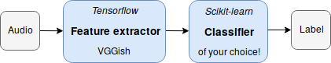

# Audio Transfer Learning with Scikit-learn and Tensorflow
We use pre-trained Tensorflow models as audio feature extractors. These deep convolutional neural networks were pre-trained with the [Audioset dataset](https://research.google.com/audioset/), that is conformed by 2M YouTube audios for the task of general audio tagging. Scikit-learn classifiers are employed to rapidly prototype competent audio classifiers that can be trained on a CPU.

See the pipeline when using the [VGGish](https://github.com/tensorflow/models/tree/master/research/audioset) model:

This material is prepared to learn about Tensorflow, Scikit-learn, and deep learning in general. Besides, due to the simplicity of Scikit-learn, this toolkit can be employed to easily build proof-of-concept models with your own data.

## Installation:
Create a python3 virtual environment `python3 -m venv env`, activate it `source ./env/bin/activate`, and install the dependencies `pip install -r requirements.txt`.

Download the pre-trained models you want to use as feature extractors. Our current implementation supports:

- **VGGish:** download the pre-trained model `wget https://storage.googleapis.com/audioset/vggish_model.ckpt` in `sklearn-audio-transfer-learning/src/`. For more details, check out their [documentation](https://github.com/tensorflow/models/tree/master/research/audioset).
- **OpenL3:** download it via pip `pip install --timeout 100000000 openl3 `. Use a large timeout, because it takes some time to download the model. For more details, check out their [documentation](https://github.com/marl/openl3).

## Music genre classification: a toy example

#### Set the task up
As an example, let's download the GTZAN dataset `wget http://opihi.cs.uvic.ca/sound/genres.tar.gz` and extract the audio files `tar -zxvf genres.tar.gz` in `sklearn-audio-transfer-learning/data/audio/GTZAN/`. Approximated download time: between 30 min and an hour. We already provide (fault-filtered) train/test partitions in `sklearn-audio-transfer-learning/data/index/GTZAN/`.

`audio_transfer_learning.py` is the main python file. Note that on its top-20 lines you can configure it. For example: you can select *(i)* which sklearn classifier to employ, and *(ii)* which pre-trained model to use for extracting features.  You can easily set your favourite sklearn classifier in `define_classification_model()`. To start, let's select `linearSVM`. We set it as follows: `LinearSVC(C=1)`. And finally, you need to select which pre-trained Tensorflow model you want to use as feature extactor. To start, let's use the `vggish`. Remember to download the pre-trained model first!

#### Run your classifier
Open the `sklearn-audio-transfer-learning/src/` directory in a terminal and run `python audio_transfer_learning.py`. Approximated run time in your laptop: 15 min.

Congrats, you have build a music genre classifier! The model we developed (VGGish + SVM) achieved 77.24% accuracy in our test set. Interestingly, this basic model can achieve better results than a standard [MFCCs + SVM classifier (53.44%)](https://arxiv.org/abs/1805.00237), and is quite competent when compared to the best result we are aware of: [82.1% accuracy](https://www.mdpi.com/2076-3417/8/1/150).

#### Can you improve this result? 

Feel free to modify our scripts, they are meant for that! 
Keep us updated if you break the state-of-the-art ;)

## I want to build my own audio classifier

In the following, we give some tips on how to build another audio classifier that is not based on the GTZAN dataset.

As an example on how to do it, let's download the ASC-TUT dataset ([dev-set](https://zenodo.org/record/400515#.W9n2UtGdZhE) / [eval-set](https://zenodo.org/record/1040168#.W9n2jNGdZhE)). With this data, you can build an acoustic scene classifier.

Copy the audio into a new directory: `sklearn-audio-transfer-learning/data/audio/ASC-TUT/`. Now create your train/test partitions. These are just lists of the files that belong to this partition. For example, access to your audio directory `sklearn-audio-transfer-learning/data/audio/ASC-TUT/dev-set/` and run `ls > train_set.txt`. Do the same for creating the test partition. Remember to configure the variables `audio_paths_train` and `audio_paths_test` (in `audio_transfer_learning.py`) with the new dataset/partitions.

The last step is to define which is the label (or ground truth) for each of the audios. You can define the correspondence between the audio path and its label in the following function `path2gt_datasets(path, dataset)` in `sklearn-audio-transfer-learning/src/utils.py`.

You are ready to go!

## Additional tips
    
#### Do you want to experiment with different Scikit-learn models?

You can easily set your favourite sklearn classifier in `define_classification_model()`. Then, select one `model_type`. The following classifiers are already implemented: `linearSVM`, `SVM`, `perceptron`, `MLP`, and `kNN`. Check [Scikit-learn's documentation](https://scikit-learn.org/stable/) to know more about its possibilities.
    
#### Does the script takes an eternity to extract the training features?

Once you have extracted the training features once, these are automatically stored in `sklearn-audio-transfer-learning/data/audio_representation/`. You can load those (instead of re-computing) by simply setting the variable `load_training_data` with the name of the file containing the pre-computed training features (e.g.: `evaluation_data_GTZAN_vggish.npz`).

To re-compute the features, just set `load_training_data` to False.
    
#### Does the script consumes too much RAM memory?

Reduce the batch size by properlly setting `batch_size`. The batch size defines the ammount of audios that are processed at once. The smaller it is, the lower the consumption of RAM memory.

When using the `openl3` feature extractor you will find out that to solve your RAM issues you will have to **increase** the batch size. We recommend to set it to 512. This is possibly due to a bug in the original Openl3 implementation.

## Scripts directory
- `audio_transfer_learning.py`: main script where we build the audio classifiers with Tensorflow and Scikit-learn.
- `utils.py`: auxiliar script with util functions that are used by `audio_transfer_learning.py`.
- `vggish_input.py`,`vggish_params.py`,`vggish_slim.py`,`mel_features.py`,`vggish_model.ckpt`: auxiliar scripts to employ the VGGish pre-trained model.

## Folders structure
- `/src`: folder containing previously listed scripts.
- `/data`: where all intermediate files (pre-computed features, audio, results, etc.) will be stored. 
- `/data/index/`: indexed files containing ground truth annotations and partitions.
- `/data/audio/`: folder where to store the audio datasets.

When running our scripts, the following folders will be created:
- `./data/audio_representation/`: where the pre-computed features are stored.
- `./data/experiments/`: where the results of the experiments are stored.
